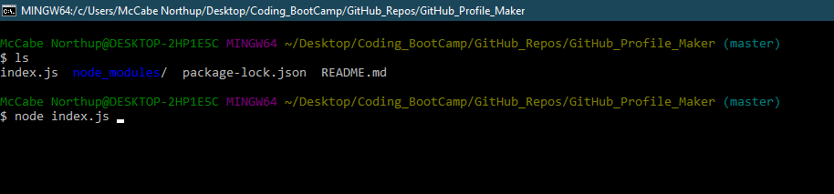

# GitHub_Profile_Maker

## Function 
- A command-line application that dynamically generates a PDF profile from a GitHub username. The application can be invoked with the following command:

- node index.js

- The user is then prompted for their GitHub username and favorite color

 
- A PDF is then generated with the users name, bio, location, blog, followers, following, stars, and repo amount.
- The user will need to use the package.json to "npm install" all dependencies for this application.

## Intended Use
- This application is created with the project or hiring manager in mind. Instead of simply having users GitHub profile links, the user can have dynamically created content that is clean and deliverable in a PDF form.

## List of links/dependencies

## Credits
Used font awesome for the save icon.
https://fontawesome.com/license

## Link to Deployed Product

https://mnorthup2207.github.io/server_side_APIs_Homework_6/